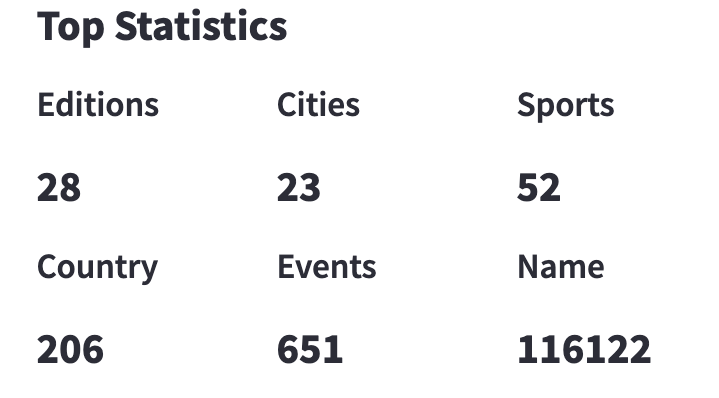
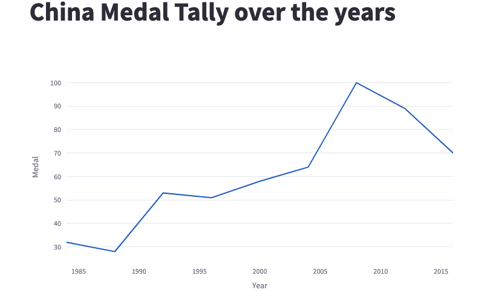

# Olympics Data Analysis 

Olympics Data Analysis Web Application using Streamlit. For development, I will be using Python and Pandas. For plotting, I will be using Seaborn and Plotly libraries.  

Link: https://u-rex13-olympic-data-analysis-main-nb95ph.streamlit.app/

* * *

## Steps To Run This Project:
  1) Fisrt Downlod the zip folder of project and unzip the folder. Open Project file and youll find another zip folder inside name as olympic-history.zip, unzip the folder  
  
  2) Install Python and Visual Studio code using below given link
     - Python Desktop Application: "https://www.python.org/downloads/"  
     - Visual Studion Code IDE: "https://code.visualstudio.com/download"
     
  3) Open the project folder inside the visual studio code
  
  4) Install the below given libery in command prompt or visual studio code terminal
  
  
  
  Below are python libery command before run this project you make sure to run all command in terminal   
  
  ```
  pip install streamlit
  ```
  ```
  pip install pandas
  ```
  ```
  pip install plotly 
  ```
  ```
  python -m pip install -U matplotlib
  ```
  ```
  pip install seaborn
  ```
  ```
  pip install requests 
  ```
  
  4) Afte installing the project required python libery we return use termianl to run our project using simple command.
  ```
  streamlit run main.py
  ``` 
  (meaning of the line is "streamlit" is package name that we are used to create this web app and run meaning to "run" this project using streamlit and "app.py" is the python file that i create the frontend of this project if in any other situation it can different if you create by own using other name so it is differnet name python extension file)
  
  5) after you run this line the streamlit create a localhost in your machine and run this web application using browser

  - This is the localhost that streamlit is host our web application
  
  
 
* * *
## Olympic Data Analysis Web Application Preview 
    Data Analysis is perfomed on four level
    - Overall Analysis
    - Country Analysis
    - Athlete Analysis
### Overall Analysis



* * *
### Country Analysis
- Overall

  



  


* * *


### Athlete Analysis

  


* * * 

### Blogs to know about core concept of project 
  - https://www.ibm.com/in-en/topics/data-visualization#:~:text=Data%20visualization%20is%20the%20representation,that%20is%20easy%20to%20understand.
  - https://www.tableau.com/learn/articles/data-visualization
  - https://powerbi.microsoft.com/en-us/data-visualization/
  - https://www.javatpoint.com/what-is-data-visualization
  - https://visme.co/blog/best-data-visualizations/
  - https://www.techtarget.com/searchdatamanagement/definition/data-analytics#:~:text=Data%20analytics%20(DA)%20is%20the,of%20specialized%20systems%20and%20software.
  - https://www.investopedia.com/terms/d/data-analytics.asp
  - https://www.simplilearn.com/tutorials/data-analytics-tutorial/what-is-data-analytics
  - https://www.tibco.com/reference-center/what-is-data-analytics
  - https://en.wikipedia.org/wiki/Data_analysis#:~:text=Data%20analysis%2C%20is%20a%20process,test%20hypotheses%2C%20or%20disprove%20theories.
  
